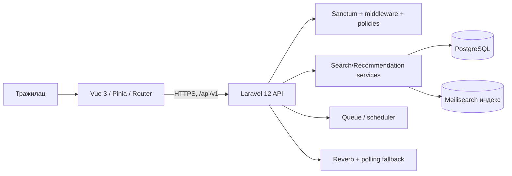
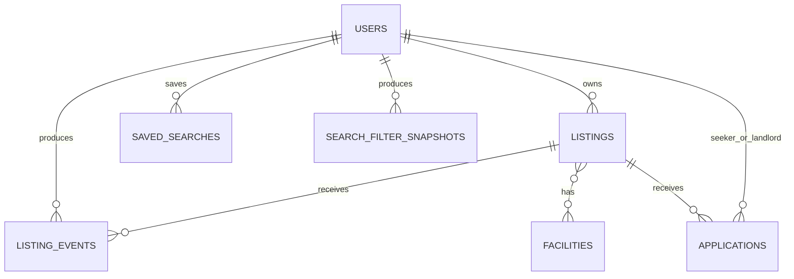
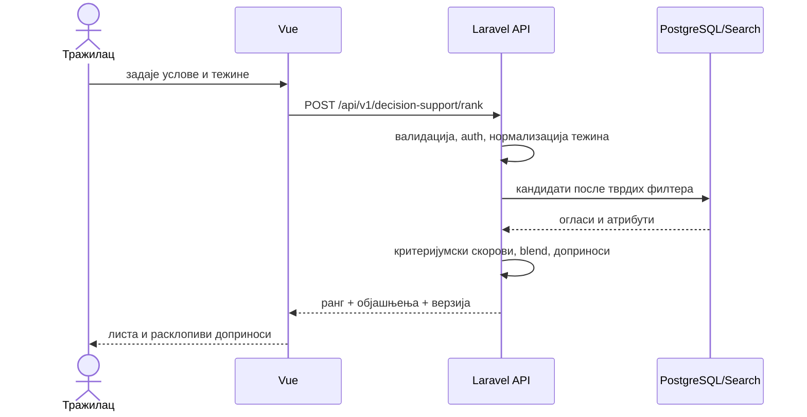

# Примењени истраживачки рад — нулта верзија

> **Статус:** радна нулта верзија; није верзија за предају<br>
> **Датум пресека кода и документације:** 28. август 2026.<br>
> **Истраживање:** није спроведено; сва поља за налазе су намерно празна<br>
> **Обим:** текст је припремљен за прелом од приближно 30–35 страна; коначан
> број зависи од DOCX прелома, дијаграма и правила установе.

---

## Насловна страна

**[НАЗИВ УНИВЕРЗИТЕТА]**<br>
**[НАЗИВ ФАКУЛТЕТА]**<br>
**[НАЗИВ СТУДИЈСКОГ ПРОГРАМА]**

### ПРИМЕЊЕНИ ИСТРАЖИВАЧКИ РАД

# ПЛАТФОРМА ЗА ИЗДАВАЊЕ СМЕШТАЈА СА ПОДРШКОМ У ОДЛУЧИВАЊУ РЕАЛИЗОВАНА У ИНТЕГРИСАНИМ ТЕХНОЛОГИЈАМА

**Предмет:** Програмирање у интегрисаним технологијама<br>
**Студент:** [ИМЕ И ПРЕЗИМЕ СТУДЕНТА]<br>
**Број индекса:** [БРОЈ ИНДЕКСА]<br>
**Предметни наставник:** [ИМЕ И ЗВАЊЕ]<br>
**Ментор:** [ИМЕ И ЗВАЊЕ]<br>
**Организација:** [НАЗИВ ОРГАНИЗАЦИЈЕ]<br>
**Ментор у организацији / основ сарадње:** [ДОПУНИТИ ИЛИ УКЛОНИТИ ПО УПУТСТВУ]

Београд, 2026.

---

## Матрица доказа пре писања

| Важна тврдња | Проверљив извор | Статус |
|---|---|---|
| Канонски API има префикс `/api/v1` | `backend/routes/api.php` | потврђено |
| Препоруке су доступне преко `GET /api/v1/recommendations` | рута, `RecommendationsController`, `RecommendationsApiTest` | потврђено |
| Постојећи механизам користи прегледе, сачуване и недавне претраге | `RecommendationService::buildPayload` | потврђено |
| Постојеће бодовање је фиксна хеуристика, а не тренирани ML модел | `RecommendationService::scoreListing`; нема обуке/модела | потврђено |
| Тренутни одговор садржи највише три текстуална разлога | `RecommendationService::buildReasons` | потврђено |
| Корисник не задаје експлицитне тежине и не добија допринос сваког критеријума | постојећи сервис, контролер и API тест | потврђено |
| Search v2 може користити Meilisearch, док map/radius ток остаје SQL | search конфигурација, контролер, тестови и `docs/04-features/search.md` | потврђено, driver/flag-зависно |
| `Application` је активан захтев за смештај; `BookingRequest` нема активну руту | руте, модели, миграције и feature тестови | потврђено |
| Постоји рангирање кандидата за издаваоца | није пронађен endpoint, сервис ни тест | планирано |
| Хибрид са експлицитним тежинама и приказом доприноса постоји у производу | није пронађен у коду | планирано |
| Узорак 10–20 испитаника и within-subject дизајн | `pir-plan.md` | потврђено као план |
| SUS, Likert и објективне метрике ће показати побољшање | подаци још нису прикупљени | недостаје податак |

### Стварни блокери нулте верзије

1. Нису достављени сви административни подаци у облику погодном за насловну страну.
2. Није потврђено да ли установа дозвољава прилоге ван препорученог обима.
3. Хибридни модел и његов UI још нису потврђени кодом и тестовима.
4. Није закључан експериментални скуп огласа и сценарија.
5. Корисничко истраживање није спроведено.
6. Није обављена стручна/менторска ревизија српског превода SUS инструмента.
7. Није потврђен протокол чувања сагласности у организацији.
8. Формални стил библиографије и изглед fusnota треба ускладити са шаблоном установе при DOCX прелому.

Ниједан блокер не спречава нулту верзију: непознати подаци су означени, а
налази нису измишљени.

## Садржај и планирани обим

| Целина | Процена страна |
|---|---:|
| Насловна страна и садржај | 2 |
| 1. Увод | 2–3 |
| 2. Теоријске основе и сродна истраживања | 5–6 |
| 3. Анализа проблема и захтева | 3–4 |
| 4. Пројектовање система | 4–5 |
| 5. Постојеће стање и предлог унапређења | 4–5 |
| 6. Методологија евалуације | 4–5 |
| 7. Резултати и дискусија | 3–4 |
| 8. Анализа стручног доприноса | 1–2 |
| 9. Ограничења и претње валидности | 1–2 |
| 10. Закључак и будући рад | 1–2 |
| Литература | 2–3 |
| **Главни текст укупно** | **32–39** |
| Прилози, ако су дозвољени | ван главног обима |

---

# 1. Увод

## 1.1. Предмет и практични проблем

Предмет рада је пројектовање и евалуација транспарентне подршке трагаоцу при
избору смештаја у интегрисаној web платформи. Практични контекст је дугорочни
најам у Србији. Тражилац истовремено разматра цену, локацију, величину,
опремљеност и друге услове. Филтери уклањају неприхватљиве понуде, али сами не
изражавају увек компромис: на пример, да ли је нешто виша цена прихватљива за
бољу локацију и гаражу. Дуга листа формално прихватљивих огласа зато и даље
преноси значајан когнитивни терет на корисника.

IzdajIznajmiV2 је marketplace који повезује госте, тражиоце, издаваоце и
администраторе. Шира апликација покрива више периода најма, објављивање и
претрагу огласа, пријаве, обиласке, разговоре, обавештења и трансакционе
кораке. Истраживачки исказ овог рада је ужи: односи се искључиво на помоћ
трагаоцу при ужем избору дугорочног смештаја у Србији. Одлука издаваоца о
кандидату јесте релевантан производни проблем, али није предмет експеримента.

## 1.2. Циљ и значај

Општи циљ је да се предложи, реализује и контролисано испита модел који после
тврдих филтера рангира огласе према експлицитним приоритетима и постојећим
сигналима понашања, а кориснику приказује скор и његово образложење. Први
специфични циљ је већа мерљива усклађеност врха листе са сценаријем. Други је
ефикасније доношење одлуке. Трећи је очување употребљивости и повећање
разумљивости и поверења.

Значај је двострук. Истраживачки, рад операционализује „подршку у одлучивању“
кроз критеријуме, независне и зависне променљиве и поновљив протокол.
Стручно, повезује Vue клијент, Laravel REST API, PostgreSQL и search
инфраструктуру са објашњивим рачунањем, уместо да интеграцију сведе на каталог
технологија.

## 1.3. Хипотезе

**Општа хипотеза:** транспарентно рангирање повећава усклађеност избора са
корисничким преференцијама.

* **H1:** хибридно рангирање са експлицитним тежинама и сигналима понашања даје
  усклађеније прве резултате од базне претраге без персонализованог редоследа.
* **H2:** рангирање са објашњењем смањује број огласа које корисник прегледа до
  доношења одлуке.
* **H3:** приказ скора, доприноса критеријума и објашњења побољшава
  употребљивост и поверење у избор.

Хипотезе нису налази. H1 се оцењује објективном усклађеношћу, H2 бројем
отворених детаља (уз време као допунску меру), а H3 одвојено SUS резултатом и
трима Likert ставкама. У малом узорку резултати ће бити описни, без
неоправданог закључивања о популацији.

## 1.4. Метод и организација рада

Истраживање комбинује: анализу кода и литературе; пројектовање хибрида тврдих
правила и нормализоване пондерисане суме; техничко поређење нове методе са
постојећом хеуристиком; и within-subject кориснички тест са 10–20 испитаника.
Редослед базне и унапређене варијанте је контрабалансиран. Прикупљају се
успешност, време, број прегледаних огласа, усклађеност, SUS, три Likert оцене и
отворени коментар. Наредна поглавља граде аргумент од теорије и захтева, преко
архитектуре и алгоритма, до протокола, шаблона резултата и ограничења.

# 2. Теоријске основе и преглед сродних истраживања

## 2.1. Системи подршке одлучивању

Систем подршке одлучивању не замењује доносиоца одлуке, већ организује податке,
модел и интеракцију тако да полу-структурисана одлука постане доследнија и
проверљивија.[^1] Избор стана је полу-структурисан: део услова се може строго
формализовати, док важност цене, локације и комфора зависи од особе и
сценарија. Стога систем не треба да прогласи „објективно најбољи“ оглас, него
да покаже најбоље рангиране алтернативе под датим претпоставкама.

Корисна је подела на податке, модел и дијалог. PostgreSQL и search индекс дају
податке о алтернативама; рангирање реализује модел; Vue интерфејс омогућава
задавање приоритета и испитивање разлога. Ова три дела чине интегрисану целину.

## 2.2. Вишекритеријумско одлучивање

Вишекритеријумско одлучивање разматра алтернативе описане већим бројем, често
супротстављених критеријума. AHP формализује хијерархију и парна поређења,[^2]
док TOPSIS вреднује удаљеност од идеалног и анти-идеалног решења.[^3] Обе
методе су академски релевантне, али би парна поређења и сложеније објашњење
непотребно оптеретили мали web експеримент.

Пондерисана сума је погоднија када корисник непосредно задаје релативни значај
критеријума. Њена употреба захтева заједничку скалу и оправдану нормализацију.
Такође захтева раздвајање некомпензаторних услова од компензације: оглас ван
обавезног града не сме постати прихватљив само зато што је јефтин. Зато се
најпре примењују тврди филтери, а тек потом збир над прихватљивим кандидатима.

## 2.3. Системи препорука и хибридизација

Системи препорука традиционално користе садржај, сличност корисника и
интеракције ради процене релевантности. Преглед Adomavicius-а и Tuzhilin-а
истиче content-based, collaborative и хибридне приступе, као и проблеме
контекста, објашњења и евалуације.[^4] Хибридни систем комбинује више извора
сигнала како би ублажио слабости појединачне технике; Burke даје познату
таксономију начина таквог комбиновања.[^5]

У овом раду „хибридни“ не значи машинско учење. Експлицитне тежине се спајају
са већ доступним, правилом изведеним профилом понашања. Нема скупа за обуку,
научених параметара, offline prediction метрике ни тврдње о ML моделу.
Ограничење је намерно: мали број испитаника и синтетички/дозвољени реални
огласи нису основ за поуздано тренирање персонализованог модела.

## 2.4. Објашњиве препоруке

Објашњење може да помогне транспарентности, отклањању грешке, уверљивости,
поверењу и ефикасности, али циљеви могу бити у напетости.[^6] Текст „препоручено
за вас“ није довољан ако не открива критеријуме. Са друге стране, приказ свих
интерних детаља може преоптеретити корисника. Предложена слојевита форма зато
има: проценат/скор, три највећа доприноса и кратку реченицу; потпуна формула и
све вредности су доступне на захтев.

Објашњење мора да буде верно рачунању. Разлог се генерише из стварно
употребљеног доприноса, а не као накнадна маркетиншка реченица. Кориснику се
саопштава да је редослед подршка, не гаранција квалитета, и омогућава се промена
тежина.

## 2.5. Избор смештаја као одлука

Дугорочни најам има последице које превазилазе једнократну куповину: месечни
трошак, свакодневно путовање, приступ услугама, опремљеност и стабилност услова.
Расположиви атрибути огласа ипак нису потпуна слика. Непознати трошкови,
квалитет непосредног окружења и истинитост описа не смеју се претварати у
прецизан скор. Систем подржава ужи избор, након кога следе провера, разговор и
обилазак.

## 2.6. Интегрисане web технологије

Интегрисани систем овде значи да browser клијент, API, база, search engine,
queue и realtime канал сарађују преко дефинисаних уговора. Vue користи
компонентни реактивни UI,[^7] Laravel обезбеђује HTTP слој, валидацију и
ауторизацију,[^8] PostgreSQL транзакционо чување,[^9] а Meilisearch изведени
индекс за facet претрагу.[^10] Sanctum у real API режиму користи cookie сесију и
CSRF заштиту.[^11] Те технологије су предмет рада само тамо где носе ток
одлуке, проверљивост или репродуктивност.

# 3. Анализа проблема и захтева

## 3.1. Актери и граница одлуке

Гост прегледа јавне огласе. Тражилац претражује, чува претраге, добија
препоруке, пријављује се и заказује обилазак. Издавалац управља огласима,
пријавама и обиласцима. Администратор управља безбедносним и модерационим
процесима. Овај PIR описује платформу из обе тржишне перспективе, али мери само
одлуку трагаоца: избор огласа за ужу листу. Рангирање пријављених кандидата за
издаваоца је **планирано**, није имплементирани резултат овог рада.

## 3.2. Критеријуми и подаци

| Критеријум | Тип | Смер/обрада | Извор |
|---|---|---|---|
| град/зона | обавезни или benefit | exact filter; касније близина | оглас + унос |
| максимална цена | обавезни праг | `price <= max`; међу прихватљивим мање је боље | `price_per_month` |
| број соба | праг/benefit | минимум, затим близина циљу | `rooms`/`beds` |
| површина | праг/benefit | минимум/опсег, затим више до засићења | `area` |
| погодности | обавезни и/или benefit | покривеност изабраног скупа | facilities |
| оцена | benefit | нормализација уз приказ броја оцена | агрегат огласа |
| свежина | допунски benefit | опадајућа функција, мале тежине | `created_at` |
| сигнал понашања | допунски | прегледи и сачуване/недавне претраге | events/snapshots |

Недостајуће вредности се не третирају као нула квалитета без упозорења.
Кандидат који нема податак за тврди услов искључује се или означава за ручну
проверу, према унапред закључаном правилу. За мек критеријум скор се рачуна над
расположивим тежинама и приказује ознака непотпуности. Ово правило мора бити
исто у обе варијанте скупа података.

## 3.3. Функционални захтеви

**FR-1** систем примењује град, буџет и изабране обавезне погодности као тврде
филтере. **FR-2** корисник задаје важност меких критеријума разумљивим
контролама. **FR-3** систем нормализује тежине. **FR-4** сваки кандидат добија
репродуктиван скор и стабилан редослед при једнаким улазима. **FR-5** UI
приказује укупан скор, доприносе и кратко верно објашњење. **FR-6** корисник
може да промени тежину и види нов редослед. **FR-7** експеримент бележи само
догађаје наведене у сагласности. **FR-8** базни и унапређени UI користе исти
скуп огласа по сценарију. **FR-9** API одбија неважеће тежине. **FR-10**
ауторизација ограничава персонализоване резултате на трагаоца/администратора.

## 3.4. Нефункционални захтеви

Резултат мора бити објашњив и детерминистички за снимљени улаз; формула,
верзија и параметри морају бити забележени. API не сме да изложи туђе догађаје.
Израчун треба да остане довољно брз за интерактивну промену тежина; праг ће се
дефинисати пре теста, нпр. p95 испод [ДОПУНИТИ НАКОН ТЕХНИЧКОГ МЕРЕЊА]. UI
мора бити употребљив тастатуром, скале јасно означене, а боја не сме бити
једини носилац значења. Search индекс је изведен; база остаје извор истине.

## 3.5. Границе истраживања

Нису предмет: краткорочни најам, генерализација на цело становништво Србије,
production scale, предвиђање тржишне цене, правна подобност кандидата,
аутоматско прихватање пријаве и ML рангирање. Плаћања, KYC, chat и realtime су
контекст интегрисане платформе, а не независне променљиве експеримента.

# 4. Пројектовање система

## 4.1. Архитектура и компоненте

**Слика 1. Компонентни приказ релевантног тока (ауторски приказ на основу
кода).**



Слика 1 не тврди да сваки сервис учествује у сваком захтеву. Legacy
`/api/v1/listings` и map/radius ток користе SQL; `/api/v1/search/listings` може
користити Meilisearch у зависности од driver-а; препоруке граде кандидате кроз
апликативне сервисе и PostgreSQL податке.

## 4.2. Модел података

**Слика 2. Упрошћени модел података за одлуку (ауторски приказ; миграције су
извор истине).**



`users` је идентитет; `listings` је алтернатива; facilities су
вишевредносни атрибути; `listing_events`, `saved_searches` и
`search_filter_snapshots` су сигнали за профил. `applications` представља
стварни захтев. Табела `booking_requests` је legacy остатак без активне руте и
не користи се као канонски ентитет.

За предложени експеримент потребни су или привремени, псеудонимизовани записи
`ranking_sessions`, `ranking_preferences` и `ranking_events`, или локални
инструментациони лог који се извози без идентификатора. Коначни избор је
**[ДОПУНИТИ НАКОН ИМПЛЕМЕНТАЦИЈЕ]** и мора добити миграције, retention правило
и тестове пре прикупљања података.

## 4.3. API уговор и ток података

Канонски namespace је `/api/v1`. Постојећи `GET /api/v1/recommendations`
прихвата филтере и пагинацију. Предлог је нови, верзионисани ресурс, нпр.
`POST /api/v1/decision-support/rank`, како се експеримент не би лажно приказао
као постојећи уговор. Тело садржи `hardFilters`, `weights`, опциони
`behaviorBlend`, `scenarioId` и верзију алгоритма. Одговор садржи `listing`,
`score`, `criterionContributions`, `explanation`, `missingData` и метаподатке.

**Табела 1. Предложени минимални API пример (извор: аутор).**

```json
{
  "hardFilters": {"city": "Beograd", "priceMax": 700},
  "weights": {"price": 40, "area": 20, "rooms": 15, "amenities": 25},
  "behaviorBlend": 0.20,
  "scenarioId": "S1"
}
```

**Слика 3. Секвенца унапређене варијанте (ауторски приказ).**



## 4.4. Безбедност, приватност и интеграције

Real API клијент најпре прибавља `/sanctum/csrf-cookie`, а затим шаље cookie
credentials. Валидација је серверска; UI ограничење није безбедносна контрола.
Ауторизација и rate limiting остају на Laravel страни. Сирови догађаји другог
корисника се не враћају као објашњење. Експериментални export садржи шифру
учесника, варијанту, сценарио и метрике, не име, e-mail или садржај chat-а.

# 5. Постојеће стање и предлог унапређења

## 5.1. Шта је имплементирано

`RecommendationService` чита највише 20 новијих прегледа, десет сачуваних
претрага и пет недавних snapshot-а. Кандидате добија из сличних претходно
прегледаних огласа, сачуваних и недавних претрага и свежих огласа у
преферираном граду; ако их нема, користи свеже огласе. Захтевани филтери се
поново примењују, власникови огласи се уклањају, резултат се кешира седам
минута и ограничава на 30 кандидата.

Фиксни скор додаје до 30 поена за град, 20 за ценовни опсег, по 10 за собе и
површину, пропорционално до 15 за погодности, 5 за свежину и бонусе извора
(12/10/6/5). Разлози као „Fits your budget“ и „Similar size“ изводе се из
истог профила, али клијент не добија потпуну декомпозицију скора. То је
персонализована, content/behavior правилом заснована хеуристика. Није
тренирани модел и њени бројеви нису емпиријски научене тежине.

## 5.2. Недостаци у односу на истраживачко питање

Корисник не може да каже да му је цена двоструко важнија од површине. Скале
различитих критеријума нису формално изложене. Изворни бонус може повећати скор
независно од квалитета атрибута. Разлози су кратки, али не показују поене сваког
критеријума. Нема снимљене верзије формуле за експеримент, нити контролисаног
поређења са базним UI-јем. То не поништава практичну вредност постојећег
сервиса; чини га техничком контролом.

## 5.3. Предложени хибридни модел

Нека је (A) скуп огласа. После тврдих услова добија се:

\[
A' = \{a \in A \mid H_j(a)=1,\; j=1,\ldots,m\}.
\]

За меки критеријум (i) дефинише се нормализована вредност
(x_i(a)\in[0,1]). Експлицитне тежине (e_i\ge0) се нормализују тако да је
(\sum_i e_i=1). Понашајни профил даје (b_i\), такође нормализован. За
(\lambda\in[0,1]):

\[
w_i=(1-\lambda)e_i+\lambda b_i, \qquad
S(a)=100\sum_i w_i x_i(a).
\]

Препоручена почетна вредност **није налаз**: `lambda = 0.20`, како би
експлицитна намера доминирала. Она мора бити закључана пре теста и проверена
анализом осетљивости. Допринос је (c_i(a)=100w_ix_i(a)), па је
(S(a)=\sum_i c_i(a)). Ово омогућава верно објашњење: „Цена +31, погодности
+18, површина +12; укупно 78/100“.

За cost критеријум цене може се користити комадно-линеарна функција: 1 за цену
до жељеног нивоа, постепен пад до тврдог максимума, 0 изван максимума (који је
већ филтриран). За benefit критеријуме користи се min–max уз доменски закључане
границе и засићење, не границе тренутног резултата, како скор не би зависио од
случајног скупа конкурената. Погодности користе пондерисану покривеност.

Једнак скор разрешава се унапред дефинисано: виша покривеност експлицитних
критеријума, затим новији оглас, затим `id`. Тако је редослед поновљив.

## 5.4. План реализације и тестирања

1. Закључати критеријуме, функције корисности, `lambda` и missing-data правило.
2. Додати Request валидацију, сервис чистог рачунања и Resource одговор.
3. Додати `/api/v1` endpoint са Sanctum/middleware заштитом.
4. Додати Vue контроле тежина и приступачан приказ доприноса.
5. Верзионисати формулу и снимити hash у експериментални export.
6. Unit тестирати границе, нормализацију, monotonicity, ties и missing data.
7. Feature тестирати auth, уговор, hard filters и стабилност редоследа.
8. Направити замрзнут скуп сценарија и очекивани oracle скор.
9. Проверити responsive/accessibility и одзив.
10. Тек затим спровести кориснички протокол.

## 5.5. Статус функционалности

| Функционалност | Статус | Доказ/следећи корак |
|---|---|---|
| основна SQL претрага и филтери | имплементирано | руте, сервиси, feature тестови |
| Search v2 и facets | имплементирано, flag/driver-зависно | search код и тестови |
| map/radius претрага | имплементирано | SQL geo тестови |
| персонализована хеуристика | имплементирано | `RecommendationService`, API тест |
| кратки разлози препоруке | имплементирано | `why` атрибут |
| експлицитне тежине | планирано | FR и кораци 1–7 |
| нормализована пондерисана сума | планирано | формула у 5.3 |
| приказ доприноса и скора | планирано | API/UI предлог |
| експериментални logging | планирано | privacy review + миграције |
| техничка offline евалуација | планирано | замрзнути dataset |
| корисничко истраживање | планирано | протокол у поглављу 6 |
| рангирање кандидата за издаваоца | планирано проширење | ван PIR експеримента |
| ML модел | није имплементирано/ван обима | захтева законит и довољан dataset |

# 6. Методологија евалуације

## 6.1. Истраживачки дизајн

Евалуација има две раздвојене фазе. Техничка фаза на истим кандидатима пореди
постојећу хеуристику и предложени алгоритам. Корисничка фаза пореди **A — базну
претрагу и филтере без експлицитног ранга** и **B — хибридни ранг са
објашњењем**. Ово раздваја питање алгоритма од укупног UI ефекта.

Кориснички дизајн је within-subject: свако користи A и B. Половина добија
редослед A→B, половина B→A; код непарног броја разлика група је највише један.
Користе се два структурно еквивалентна сценарија S1 и S2 и Latin-square
распоред: A/S1→B/S2, A/S2→B/S1, B/S1→A/S2, B/S2→A/S1. Тиме се смањују ефекти
учења и тежине сценарија, мада се не уклањају потпуно.

## 6.2. Узорак и регрутовање

Планира се пригодни узорак од 10–20 пунолетних особа које су тражиле стан или
реално могу да разумеју задатак дугорочног најма. Бележе се само категорије:
старосни опсег, искуство тражења (`никада`, `једном`, `више пута`) и учесталост
коришћења web огласа. Запослени на пројекту могу учествовати само ако се
њихови резултати означе и прикажу одвојено у sensitivity анализи. Нема
финансијског или другог притиска за учешће.

## 6.3. Материјал и сценарији

Обе варијанте користе исти замрзнути скуп од [ДОПУНИТИ БРОЈ ОГЛАСА] синтетичких
и дозвољених реалних записа, без личних података издаваоца. Огласи морају
садржати намерне trade-off односе, али не смеју имати очигледно доминантног
победника. Слике морају бити сопствене, лиценциране или placeholder-и.

* **S1 — запослена особа:** Београд, максимално [ДОПУНИТИ] EUR, најмање
  [ДОПУНИТИ] соба; цена и локација су приоритет, гаража пожељна.
* **S2 — студентски/дељени најам:** [ДОПУНИТИ ГРАД], максимално [ДОПУНИТИ]
  EUR; интернет је обавезан, површина и опремљеност имају дефинисане тежине.

Бројеви се закључавају пилотом, пре првог стварног учесника. Сценарији морају
имати упоредиву тежину према пилот времену и броју валидних кандидата.

## 6.4. Поступак и информисани пристанак

1. Истраживач чита кратко обавештење и прикупља потписану/електронску сагласност.
2. Додељује се насумична шифра и један од четири редоследа.
3. Учесник добија неутрално упутство и пробни задатак који не улази у анализу.
4. За прву варијанту чита сценарио, покреће задатак и бира један оглас.
5. Систем/посматрач бележи почетак, крај, отворене детаље, избор и грешке.
6. Учесник попуњава SUS за управо коришћену варијанту.
7. Следи кратка пауза и друга варијанта са другим сценаријем.
8. Поново се бележе метрике и SUS; затим три Likert ставке за унапређени приказ.
9. Поставља се отворено питање, врши debrief и подсећа на право повлачења.

Модератор не објашњава логику током задатка. Помоћ се даје само по унапред
дефинисаној реченици и бележи као интервенција. Пре теста се проверавају исти
browser, viewport, мрежа и reset стања.

## 6.5. Операционализација и метрике

**Примарна усклађеност избора.** За сценарио се унапред дефинише oracle функција
истим нормализованим критеријумима, али се не користи редослед UI-ја. Скор
изабраног огласа је 0–100. Додатно се бележе `Precision@3` и `nDCG@k` у
техничкој фази; дефиниције и `k` се закључавају пре увида у исходе.[^12]

**Број прегледаних огласа** је број јединствених отварања странице/панела
детаља од старта до потврде. Поновно отварање се посебно бележи, али не увећава
примарну меру. **Време** је разлика server/client monotonic timestamp-а, без
пробног задатка. **Успешност** значи избор који испуњава све тврде услове у
року [ДОПУНИТИ НАКОН ПИЛОТА].

**SUS** има десет ставки на скали 1–5.[^13] За непарне ставке од одговора се
одузима 1; за парне се од 5 одузима одговор; збир се множи са 2,5. Резултат
0–100 није проценат. Ако ставка недостаје, SUS се не импутира, већ означава као
недостајући за ту варијанту. Поређење A/B користи упарене разлике.

**Likert ставке (1 — уопште се не слажем; 5 — потпуно се слажем):**

1. „Рангирање одговара преференцијама задатим у сценарију.“
2. „Разумем зашто су приказани огласи добили своје позиције.“
3. „Имао/ла бих поверења да овај приказ користим при ужем избору смештаја.“

Likert ставке се приказују појединачно (медијана, IQR и расподела), без
необразложеног сабирања у валидирану скалу. Отворено питање гласи: „Шта је
највише помогло, а шта је отежало избор?“

## 6.6. Техничка евалуација

На замрзнутом dataset-у и скупу профила извршавају се: (1) hard-filter recall
провера; (2) рангирање постојећом хеуристиком; (3) рангирање предложеним
моделом; (4) `Precision@3`, `nDCG@5`, oracle score top-1 и latency; (5) анализа
осетљивости за `lambda` и ±10% сваке тежине. Dataset, seed, commit hash,
алгоритамска верзија и команда морају бити сачувани. Ако експлицитне
преференције нису имплементиране, ова фаза остаје план, не резултат.

## 6.7. План анализе

Приказати `n`, недостајуће вредности, медијану, IQR, минимум и максимум; за
приближно симетричне мере додати средњу вредност и SD. За сваког учесника
израчунати `B − A` за усклађеност и SUS, односно `A − B` за број прегледа и
време, тако да позитивно означава очекивано побољшање. Приказати све упарене
линије или jittered тачке, не само просек. Са 10–20 особа inferential тест и
`p` вредност нису услов за закључак; ако се ипак дода Wilcoxon тест, мора се
приказати effect size и interval, уз јасну ознаку exploratory анализе.

H1 добија подршку само ако смер упарене разлике у примарној усклађености
претежно иде у корист B и технички налази нису контрадикторни. H2 се односи на
јединствена отварања; време је допунско. H3 се не проглашава на основу само
једне мере: SUS говори о употребљивости, ставке о разумевању и поверењу.

## 6.8. Приватност и етика

Прикупља се минимум података, са шифром уместо идентитета. Табела која повезује
контакт и шифру, ако је уопште потребна, чува се одвојено и брише после
[ДОПУНИТИ РОК]. Учесник може да прескочи питање, прекине тест без последица и
затражи брисање до тренутка анонимизације. Screen/audio recording се не врши
без посебне опционе сагласности. Резултати се извештавају агрегирано; цитат из
отвореног одговора се очисти од идентификатора. Правни основ и институционално
одобрење проверавају ментор и организација пре регрутовања.

# 7. Резултати и дискусија

> **[ДОПУНИТИ НАКОН ИСТРАЖИВАЊА]** Ово поглавље је шаблон. Нема стварних
> учесника, мерења, SUS скорова, процената ни потврђених хипотеза.

## 7.1. Ток узорка и квалитет података

Пријављено: **[ДОПУНИТИ НАКОН ИСТРАЖИВАЊА]**; завршило обе варијанте:
**[ДОПУНИТИ НАКОН ИСТРАЖИВАЊА]**; искључено са разлогом:
**[ДОПУНИТИ НАКОН ИСТРАЖИВАЊА]**. Навести расподелу редоследа, искуство,
недостајућа поља, интервенције модератора и техничке инциденте.

**Табела 2. Карактеристике и редослед учесника (извор: будуће истраживање).**

| ID | искуство | редослед | комплетно | напомена |
|---|---|---|---|---|
| [ДОПУНИТИ НАКОН ИСТРАЖИВАЊА] |  |  |  |  |

## 7.2. Технички резултати

**Табела 3. Поређење алгоритама (извор: будуће мерење).**

| варијанта | профила | top-1 oracle | Precision@3 | nDCG@5 | p95 ms |
|---|---:|---:|---:|---:|---:|
| постојећа хеуристика | [ДОПУНИТИ НАКОН ИСТРАЖИВАЊА] |  |  |  |  |
| предложени хибрид | [ДОПУНИТИ НАКОН ИСТРАЖИВАЊА] |  |  |  |  |

Предлог графикона 1: линија промене `nDCG@5` кроз вредности `lambda`, са
називом, јединицама и напоменом да је у питању sensitivity анализа.

## 7.3. Корисничке метрике

**Табела 4. Упарене објективне метрике (извор: будуће истраживање).**

| метрика | A медијана (IQR) | B медијана (IQR) | медијана упарене разлике | n |
|---|---:|---:|---:|---:|
| усклађеност 0–100 | [ДОПУНИТИ НАКОН ИСТРАЖИВАЊА] |  |  |  |
| јединствено отворени огласи | [ДОПУНИТИ НАКОН ИСТРАЖИВАЊА] |  |  |  |
| време (s) | [ДОПУНИТИ НАКОН ИСТРАЖИВАЊА] |  |  |  |
| успешност | [ДОПУНИТИ НАКОН ИСТРАЖИВАЊА] |  |  |  |

**Табела 5. SUS и Likert (извор: будуће истраживање).**

| мера | A | B | правило приказа |
|---|---:|---:|---|
| SUS | [ДОПУНИТИ НАКОН ИСТРАЖИВАЊА] |  | медијана, IQR, упарене тачке |
| усклађеност ранга | није применљиво | [ДОПУНИТИ НАКОН ИСТРАЖИВАЊА] | 1–5 расподела |
| разумевање | није применљиво | [ДОПУНИТИ НАКОН ИСТРАЖИВАЊА] | 1–5 расподела |
| поверење | није применљиво | [ДОПУНИТИ НАКОН ИСТРАЖИВАЊА] | 1–5 расподела |

Предлог графикона 2: по једна линија A→B за сваког учесника за усклађеност.
Предлог графикона 3: paired dot plot броја отворених огласа. Предлог графикона
4: diverging stacked bar за сваку Likert ставку. Сваки графикон мора имати број,
назив, извор и референцу у тексту.

## 7.4. Условна дискусија

* Ако је усклађеност виша у B код већине учесника и offline метрике су
  сагласне, навести да резултати **подржавају H1 у испитаном узорку**, не да је
  хипотеза универзално доказана. **[ДОПУНИТИ НАКОН ИСТРАЖИВАЊА]**
* Ако се број прегледа смањи, али време порасте, H2 размотрити само по
  пре-регистрованој примарној мери и објаснити могућу цену читања објашњења.
  **[ДОПУНИТИ НАКОН ИСТРАЖИВАЊА]**
* Ако SUS опадне, а поверење порасте, не спајати налазе у једну тврдњу; могуће
  је да транспарентност помаже разумевању, али додаје сложеност.
  **[ДОПУНИТИ НАКОН ИСТРАЖИВАЊА]**
* Нулти или мешовит смер је валидан налаз. Проверити floor/ceiling ефекте,
  редослед, сценарио, искуство и missing data без post-hoc мењања хипотезе.
  **[ДОПУНИТИ НАКОН ИСТРАЖИВАЊА]**

# 8. Анализа стручног доприноса

Планирани стручни допринос није нова општа теорија препорука, већ проверљива
примена: (1) ревизија стварног система која спречава погрешну ML тврдњу; (2)
формализација одлуке и раздвајање тврдих услова од компензације; (3) верна
декомпозиција скора; (4) верзионисан API ток кроз Vue, Laravel и PostgreSQL;
(5) репродуктиван dataset и тестови; и (6) етички, контрабалансиран протокол.

Када реализација буде завршена, овде треба навести commit, тестове, измерени
одзив и разлику у односу на постојећу хеуристику:
**[ДОПУНИТИ НАКОН ИМПЛЕМЕНТАЦИЈЕ И ИСТРАЖИВАЊА]**. Примењивост је ограничена
на ужи избор огласа; коначна одлука захтева проверу података и обилазак.

# 9. Ограничења и претње валидности

**Интерна валидност.** Within-subject дизајн носи учење и замор; ублажавају их
контрабалансирање, еквивалентни сценарији и пауза. Не може се потпуно раздвојити
ефекат алгоритма од визуелног објашњења у двема UI варијантама, па постоји
посебна техничка фаза. Instrumentation грешка и помоћ модератора се бележе.

**Екстерна валидност.** Пригодни узорак 10–20 особа, лабораторијски задатак и
ограничен скуп огласа не представљају све тражиоце, градове, сезоне и реалан
финансијски ризик. Резултати се не генерализују на краткорочни најам нити на
издаваоце.

**Конструктивна валидност.** Oracle score је модел преференција, не стварна
срећа са станом. Број отварања не обухвата дубину читања. SUS мери
употребљивост, не поверење; три сопствене Likert ставке нису валидирана скала.
Score може створити лажан утисак прецизности, због чега се приказују
претпоставке и missing data.

**Статистичка закључна валидност.** Мали узорак има ниску снагу и осетљив је на
екстреме. Више исхода повећава ризик cherry-picking-а. Примарне мере и смер
разлике се закључавају пре анализе; нагласак је на појединачним вредностима,
распонима и effect size-у.

**Техничке претње.** Feature flag, SQL/Meilisearch driver, кеш и промена
dataset-а могу мењати редослед. За тест се фиксирају конфигурација, seed,
cache state, commit и верзија алгоритма. Синтетички огласи могу имати
нереалистичне корелације. Понашајни сигнали могу појачати раније случајне
изборе и cold-start остаје ограничење.

# 10. Закључак и правци будућег рада

Рад је поставио нулту верзију академски проверљивог приступа подршци трагаоцу
при избору дугорочног смештаја. Анализа кода показује да платформа већ има
персонализовану хеуристику и кратке разлоге, али нема експлицитне тежине,
формализовану нормализацију, декомпозицију скора ни контролисану евалуацију.
Зато је предложен хибрид тврдих филтера и пондерисане суме који експлицитну
намеру комбинује са ограниченим утицајем понашања.

Ни општа ни специфичне хипотезе у овој верзији нису потврђене. Следећи
обавезни кораци су имплементација и тестирање предложеног API/UI тока, пилот,
етичка провера, затим прикупљање и транспарентна анализа података.
**[ДОПУНИТИ НАКОН ИСТРАЖИВАЊА: коначан одговор на сваку хипотезу].**

Будући рад обухвата longitudinal посматрање стварних избора, fairness проверу,
бољи модел неизвесности и научене моделе тек након довољног и законито
обрађеног скупа. Рангирање кандидата за издаваоца захтева засебне критеријуме,
правну/етичку процену и ново истраживање; не сме се извести из ових налаза.

# Литература

1. Power, D. J., Sharda, R., Burstein, F. (2015). *Decision Support Systems*.
   Wiley Encyclopedia of Management. https://doi.org/10.1002/9781118785317.weom070211
2. Saaty, T. L. (1980). *The Analytic Hierarchy Process*. McGraw-Hill. ISBN
   978-0-07-054371-3.
3. Hwang, C.-L., Yoon, K. (1981). *Multiple Attribute Decision Making:
   Methods and Applications*. Springer. https://doi.org/10.1007/978-3-642-48318-9
4. Adomavicius, G., Tuzhilin, A. (2005). Toward the Next Generation of
   Recommender Systems: A Survey of the State-of-the-Art and Possible
   Extensions. *IEEE Transactions on Knowledge and Data Engineering*, 17(6),
   734–749. https://doi.org/10.1109/TKDE.2005.99
5. Burke, R. (2002). Hybrid Recommender Systems: Survey and Experiments.
   *User Modeling and User-Adapted Interaction*, 12, 331–370.
   https://doi.org/10.1023/A:1021240730564
6. Zhang, Y., Chen, X. (2020). Explainable Recommendation: A Survey and New
   Perspectives. *Foundations and Trends in Information Retrieval*, 14(1),
   1–101. https://doi.org/10.1561/1500000066
7. Vue.js. *Introduction — Vue.js documentation*. https://vuejs.org/guide/introduction.html
   (приступљено 28. 8. 2026).
8. Laravel. *Laravel 12.x Documentation*. https://laravel.com/docs/12.x
   (приступљено 28. 8. 2026).
9. PostgreSQL Global Development Group. *PostgreSQL Documentation*.
   https://www.postgresql.org/docs/ (приступљено 28. 8. 2026).
10. Meilisearch. *Documentation*. https://www.meilisearch.com/docs
    (приступљено 28. 8. 2026).
11. Laravel. *Sanctum — Laravel 12.x Documentation*.
    https://laravel.com/docs/12.x/sanctum (приступљено 28. 8. 2026).
12. Järvelin, K., Kekäläinen, J. (2002). Cumulated gain-based evaluation of IR
    techniques. *ACM Transactions on Information Systems*, 20(4), 422–446.
    https://doi.org/10.1145/582415.582418
13. Brooke, J. (1996). SUS: A “Quick and Dirty” Usability Scale. У: Jordan,
    P. W. et al. (ур.), *Usability Evaluation in Industry*, 189–194. Taylor &
    Francis. ISBN 978-0-7484-0460-5.
14. Bangor, A., Kortum, P. T., Miller, J. T. (2008). An Empirical Evaluation
    of the System Usability Scale. *International Journal of Human–Computer
    Interaction*, 24(6), 574–594. https://doi.org/10.1080/10447310802205776
15. Ricci, F., Rokach, L., Shapira, B. (ур.) (2022). *Recommender Systems
    Handbook*, 3. изд. Springer. https://doi.org/10.1007/978-1-0716-2197-4

[^1]: Power, Sharda и Burstein, *Decision Support Systems*, 2015.
[^2]: Saaty, *The Analytic Hierarchy Process*, 1980.
[^3]: Hwang и Yoon, *Multiple Attribute Decision Making*, 1981.
[^4]: Adomavicius и Tuzhilin, 2005, стр. 734–749.
[^5]: Burke, 2002, стр. 331–370.
[^6]: Zhang и Chen, 2020, стр. 1–101.
[^7]: Vue.js, званична документација, приступљено 28. 8. 2026.
[^8]: Laravel 12.x, званична документација, приступљено 28. 8. 2026.
[^9]: PostgreSQL, званична документација, приступљено 28. 8. 2026.
[^10]: Meilisearch, званична документација, приступљено 28. 8. 2026.
[^11]: Laravel Sanctum 12.x, званична документација, приступљено 28. 8. 2026.
[^12]: Järvelin и Kekäläinen, 2002, стр. 422–446.
[^13]: Brooke, 1996, стр. 189–194; видети и Bangor, Kortum и Miller, 2008.

---

# Прилог А — комплетан упитник

## A.1. Уводна питања

1. Старосни опсег: 18–24 / 25–34 / 35–44 / 45–54 / 55+ / не желим да кажем.
2. Искуство у тражењу дугорочног смештаја: никада / једном / више пута.
3. Учесталост коришћења web огласа: ређе од месечно / месечно / недељно / чешће.

## A.2. SUS после сваке варијанте

Скала: 1 — уопште се не слажем; 5 — потпуно се слажем. Коначни српски превод
мора бити менторски проверен пре примене.

1. Мислим да бих желео/ла често да користим овај систем.
2. Систем ми је деловао непотребно сложено.
3. Мислим да је систем једноставан за коришћење.
4. Мислим да би ми за коришћење била потребна помоћ техничке особе.
5. Различите функције система су добро повезане.
6. У систему има превише недоследности.
7. Верујем да би већина људи брзо научила да користи систем.
8. Систем ми је деловао веома незграпно за коришћење.
9. Осећао/ла сам се сигурно док сам користио/ла систем.
10. Морао/ла бих много тога да научим пре него што почнем да користим систем.

Следе три Likert ставке из 6.5 и отворено питање: „Шта је највише помогло, а
шта је отежало избор?“

# Прилог Б — задаци испитаника

Модератор предаје само један сценарио истовремено. Задатак је: „Пронађите и
изаберите један оглас који бисте уврстили у ужи избор. Завршите када сте
довољно сигурни да бисте заказали обилазак.“ Комплетни S1/S2 параметри се
уносе после пилота: **[ДОПУНИТИ НАКОН ПИЛОТА]**.

# Прилог В — образац информисане сагласности

Позвани сте у истраживање начина избора огласа за дугорочни најам. Учешће траје
око [ДОПУНИТИ] минута и обухвата два задатка и упитнике. Бележе се време,
отварања огласа, избор и одговори; не испитује се Ваша способност. Учешће је
добровољно. Можете прескочити питање или одустати без последица. Подаци се
чувају под шифром, користе за академску анализу и бришу/анонимизују после
[ДОПУНИТИ]. За повлачење података до анонимизације обратите се
[КОНТАКТ]. Ризик је минималан и своди се на могући замор; нема гаранције
директне користи.

☐ Прочитао/ла сам обавештење, пунолетан/на сам и добровољно пристајем.<br>
☐ Посебно пристајем на снимање екрана/звука (опционо; уклонити ако се не снима).

Шифра: ______ Датум: ______ Потпис/електронска потврда: ______

# Прилог Г — регистар ознака за допуну

| Ознака/место | Услов затварања |
|---|---|
| насловна страна | административни подаци и шаблон установе |
| NFR p95 праг | пре-регистрован праг и техничко мерење |
| избор експерименталног storage-а | имплементација, migration и privacy review |
| сценарији, број и рок | пилот и закључан dataset |
| retention и контакт | одобрен протокол организације |
| поглавље 7, све табеле и графикони | стварно истраживање и проверен export |
| стручни допринос | commit, тестови и мерења |
| закључак о H1–H3 | анализа без фабриковања |

# Прилог Д — контролна листа усклађености са PIR упутством

| Захтев | Статус у нултој верзији |
|---|---|
| практичан проблем из области студија | испуњено, поглавља 1 и 3 |
| веза са практичном реализацијом | испуњено, поглавља 4 и 5 |
| предмет, циљ, значај и методологија | испуњено, увод |
| општа и специфичне хипотезе | испуњено; нису проглашене потврђеним |
| анализа резултата | припремљен нефабрикован шаблон |
| анализа стручног доприноса | припремљено, чека реализацију |
| закључак и ограничења | испуњено уз ознаке за допуну |
| потпуна литература и страни извори | испуњено; проверити стил у DOCX |
| fusnote повезане са литературом | испуњено у Markdown облику |
| број, назив, извор и референца за слике/табеле | испуњено у радном тексту |
| препоручени TNR 12, проред 1,5, маргине 2,5 cm | применити у DOCX прелому |
| одобрење ментора пре предаје | није административно завршено |

## Проверени извори и тврдње које још захтевају проверу

Сви коришћени извори су наведени у Литератури; технички наводи су додатно
проверени према рутама, сервисима, миграцијама, конфигурацији и тестовима у
репозиторијуму. Пре формалне предаје треба поново проверити библиографске
метаподатке у библиотечком каталогу, доступност стабилних URL-ова, званичан
српски SUS превод, административне податке, услове прилога и тачан захтевани
стил fusnota. Емпиријске тврдње о H1–H3, latency-ју, узорку и употребљивости
остају непроверене док се не спроведу имплементација и истраживање.
